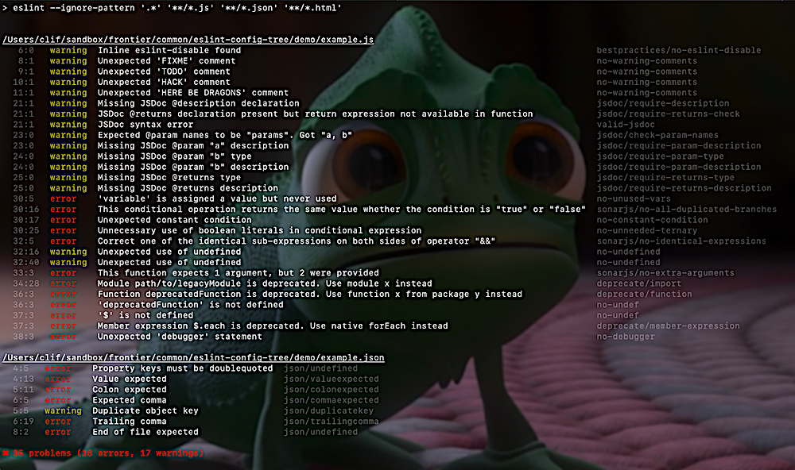

# eslint-config-tree

This is a shared configuration for all Tree repositories. Contains overrides and enhancements on top of the base configuration located at [https://github.com/fs-webdev/eslint-config-frontier](https://github.com/fs-webdev/eslint-config-frontier).

Utilizes the following plugins:

 - [eslint-plugin-bestpractices](https://github.com/skye2k2/eslint-plugin-bestpractices)
 - [eslint-plugin-deprecate](https://github.com/AlexMost/eslint-plugin-deprecate)
 - [eslint-plugin-html](https://github.com/BenoitZugmeyer/eslint-plugin-html)
 - [eslint-plugin-jsdoc](https://github.com/gajus/eslint-plugin-jsdoc)
 - [eslint-plugin-json](https://github.com/azeemba/eslint-plugin-json)
 - [eslint-plugin-no-only-tests](https://github.com/levibuzolic/eslint-plugin-no-only-tests)
 - [eslint-plugin-no-skip-tests](https://github.com/romaingaillardjs/eslint-plugin-no-skip-tests)
 - [eslint-plugin-promise](https://github.com/xjamundx/eslint-plugin-promise)
 - [eslint-plugin-sonarjs](https://github.com/SonarSource/eslint-plugin-sonarjs)
 - [eslint-config-standard](https://github.com/standard/eslint-config-standard)

> POTENTIALLY WORTH CONSIDERING IN THE FUTURE (MAY NOT WORK BECAUSE OF NEEDING SOMETHING LIKE BABEL?):

> - 'eslint-plugin-i18next' // SEEMS LIKE TOO MANY FALSE POSITIVES
> - 'eslint-plugin-json-format' // DOESN'T SEEM TO WORK
> - 'eslint-plugin-package-json' // undefined TypeErrors while parsing package.json
> - 'eslint-plugin-sort-keys-fix' // RUINS INDENTATION, DOES NOT BRING JSDOCS ALONG

## Usage:

 1. Add either `eslint-config-frontier` or `eslint-config-frontier-react` as a devDependency.

 1. Add this repository as a package devDependency:

    > "eslint-config-tree": "github:fs-webdev/eslint-config-tree#semver:^2",

 1. In your `eslintrc.js` file, put the following:
<pre><code>module.exports = {
  extends: [
    'eslint-config-frontier', // or '@fs/eslint-config-frontier-react'
    'eslint-config-tree'
  ],
  plugins: [
    'eslint-plugin-bestpractices',
    'eslint-plugin-deprecate',
    'eslint-plugin-no-only-tests',
    'eslint-plugin-no-skip-tests',
    'eslint-plugin-promise',
    'eslint-plugin-sonarjs',
    'eslint-plugin-test-selectors'
  ]
}</code></pre>

 1. Add a `.codeclimate.eslintrc.js`
 <pre><code>module.exports = {
  extends: [
    './eslint-config-frontier.js', // or '@fs/eslint-config-frontier-react'
    './eslint-config-tree.js'
  ]
}</code></pre>

 1. Add both `tree` and the frontier eslint configuration of your choice as Code Climate `prepare` resources (see: [extended eslint docs](https://www.familysearch.org/frontier/legacy/ui-components/eslint-config-frontier/)).

 1. Set this simplified eslint configuration as the chosen config in your Code Climate's `plugins`: `eslint`: `config`: `config`.

 1. Enjoy.

## Testing/Updating:

Occasionally, there may be an update which breaks a rule in particular or linting in general. To this end, when running `npm test`, we output the current linting results to a text file, clean it up a little, and employ ava to run a snapshot comparison unit test to determine if our linting output has changed from the previous run.

If there has been a change (say you added a new rule, or there is a new valid violation triggered), you can update the snapshot via `npm run test:update`.

## Notes

- Because this is a public repository, there are complications in adding references to private services and communications channels, so there is no Travis CI build and no Code Climate integration.
- Coverage reporting ends up reporting on `lint-output.js`, instead of `index.js`, and so is also not used.
- As noted in the `Testing/Updating` section, the only validation we do is to run linting against a file with a set of known failures. So we make sure to run `npm test` via a pre-push hook.

## Changelog:

Version 3 - ESLint 7

- ESLint and dependencies updated to version 7.

Version 2 - ESLint 6

- ESLint and dependencies based on version 6.

